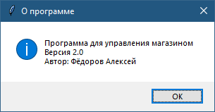
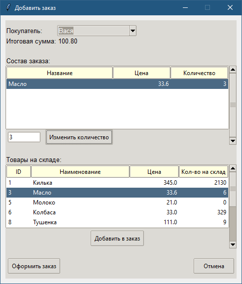

# itog_mvc

Проект итоговой аттестации (начальный курс по Python в Иннополис)
# Интернет-магазин, программа учета заказов

Это прототип настольного приложения для менеджеров интернет-магазина, разработанный в качестве итоговой аттестации по курсу Python.

## Возможности

*   **Управление данными**: Регистрация клиентов, редактирование данных клиентов, удаление клиентов, добавление товаров, редактирование товаров, удаление товаров, создание заказов, редактирование заказов, удаление заказов
*   **Графический интерфейс**: Удобный GUI на `tkinter` для всех основных операций.
*   **Анализ данных**: Визуализация динамики продаж, определение лучших клиентов и построение графа связей.
*   **Импорт/Экспорт**: Поддержка форматов CSV и JSON (для клиентов, товаров и заказов отдельно).
*   **Валидация**: Проверка корректности вводимых данных (email, телефон) с помощью регулярных выражений.
*   **Хранение данных**: Все данные сохраняются в локальной базе данных SQLite (`data/products.sqlite`).


## Описание модулей

-   `main.py`: Главный файл для запуска приложения.
-   `models.py`: Определяет классы данных: `Client`, `Product`, `Order`.
-   `db.py`: Отвечает за взаимодействие с базой данных SQLite.
-   `gui.py`: Содержит весь код графического интерфейса, созданного с помощью `tkinter`.
-   `controller.py`: Контроллер проекта. С помощью него осуществляется взаимодействие между db и gui, обрабатываются все данные, результаты которых отправляются или в графический интерфейс или для получения/отправки данных в БД.
-   `analysis.py`: Реализует функции для анализа данных и их визуализации с помощью `pandas`, `matplotlib` и `networkx`.
-   `tests/`: Папка с unit-тестами для модулей `models` и `analysis`.

## Установка и запуск

1.  **Клонируйте репозиторий:**
    ```bash
    git clone <URL вашего репозитория>
    cd itog_mvc
    ```

2.  **Создайте и активируйте виртуальное окружение:**
    ```bash
    python -m venv venv
    # Для Windows
    venv\Scripts\activate
    # Для macOS/Linux
    source venv/bin/activate
    ```

3.  **Установите зависимости:**
    ```bash
    pip install -r requirements.txt
    ```

4.  **Запустите приложение:**
    ```bash
    python -m main
    ```

## Запуск тестов

Для запуска unit-тестов выполните команду:

```bash
python -m unittest discover tests
```

## Демонстрация возможностей

Скриншоты демонстрируют основные функциональные возможности приложения:

В основном окне программы есть меню с пунктами: "Файл", "Справка"
В меню Файл, есть пункт меню "Выход", при выборе - осуществляется выход из программы.

 
 
В меню "Справка" есть пункт "О программе", при выбор показывается информация о программе




Ниже выбор вкладок "Клиенты", "Товары", "Заказы", "Аналитика и визуализация"

### Вкладки "Клиенты", "Товары", "Заказы"

Вкладки "Клиенты", "Товары", "Заказы" представляют собой одинаковый набор функционала и схожий внешний вид. 
Список клиентов/товаров/заказов и управляющие кнопки "Добавить клиента/товар/заказ", "Редактировать клиента/товар/заказ", "Удалить клиента/товар/заказ", "Экспорт в CSV/JSON", "Импорт из CSV/JSON".


Во всех вкладках есть поисковая строка, которая фильтрует списки по вхождению поискового запроса. Кнопка "Очистить" очищает окно ввода поискового запроса и выводит полный список клиентов/товаров/заказов.


Окна добавления клиентов/товаров и редактирования клиентов/товаров довольно похожи.
При редактировании в поля ввода значений автоматически вводятся исходные значения.


Окна добавления и редактирования заказов значительно отличается по функционалу и внешнему виду от соответствующих окон в "Клиентах" и "Товарах":


В окно редактирования заказа также загружается информация по редактируемому заказу.




### Вкладка "Анализ и визуализация"

Во вкладке "Анализ и визуализация" отображаются три графика: "Топ-5 клиентов по числу заказов", "Динамика количества заказов по датам", "Граф связей клиентов по общим товарам":


### Дополнительный функционал

Кроме этого во вкладке "Заказы" есть сортировка списка заказов по столбцам "ID", "Дата создания", "Итоговая сумма". Нажимая на заголовок столбца - применяется сортировка по убыванию, повторное нажатие на тот же заголовок - применяет обратную сортировку.
На скриншотах сортировка по "Дате создания" по убыванию и возрастанию:


В интерфейсе предусмотрено большое количество проверок, которые реализуют значительную информативность в плане "User friendly" интерфейса и защиты от случайных/непродуманных действий.


---